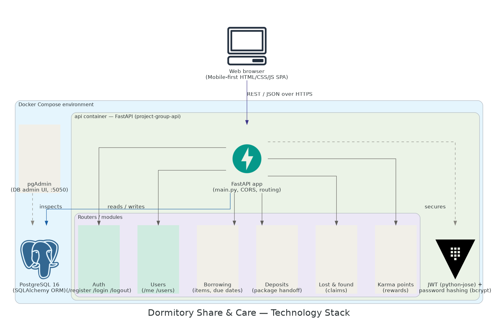
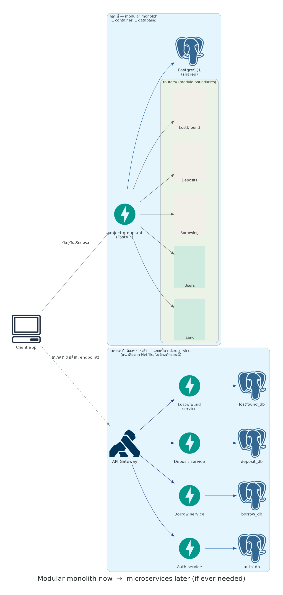

# 🏠 Dormitory Share & Care

เว็บแอปต้นแบบ (Frontend Prototype) สำหรับระบบยืม-คืนของส่วนกลาง ฝากของ และของหายได้คืนในหอพัก ออกแบบแบบ Mobile-First ใช้งานง่าย กดเข้าฟีเจอร์ได้ในคลิกเดียว พร้อมระบบสะสมแต้มความดี (Karma Points) เพื่อสร้างสังคมหอพักที่น่าอยู่ — **โปรเจกต์นี้รวม Frontend + Backend (FastAPI + PostgreSQL) ไว้ใน repo เดียวกัน**


---

## 📊 ความคืบหน้าของโปรเจกต์

**ภาพรวม: ทำไปแล้วประมาณ 25% จาก 100%** (นับจาก checklist ด้านล่าง 5 จาก 19 ข้อ — เป็นตัวเลขคร่าวๆ ตามจำนวนงาน ไม่ได้ถ่วงน้ำหนักตามความยากของแต่ละงาน)

| ส่วน | สถานะ |
|---|---|
| UI หน้าเว็บทุกหน้า (mock data) | ✅ เสร็จ |
| Backend: Auth (register/login/logout) | ✅ เสร็จ |
| Backend: User management | ✅ เสร็จ |
| เชื่อม Auth หน้าเว็บ ↔ Backend จริง | ✅ เสร็จ |
| Docker Compose (dev environment) | ✅ เสร็จ |
| Backend: ยืม-คืนของ / ฝากของ / ของหาย / แต้มความดี | ❌ ยังไม่ทำ |
| เชื่อม 4 ฟีเจอร์ข้างต้น กับ Backend จริง | ❌ ยังไม่ทำ |
| Role/Admin, Migration, Dashboard นิติบุคคล ฯลฯ | ❌ ยังไม่ทำ |

ส่วนที่เหลือใหญ่สุดคือฝั่ง backend ของ 4 ฟีเจอร์หลัก (ยืม-คืน, ฝากของ, ของหาย, แต้มความดี) ที่ตอนนี้หน้าเว็บยังใช้ mock data อยู่ทั้งหมด

---

## ✨ ฟีเจอร์หลัก

- 🔐 เข้าสู่ระบบ / สมัครสมาชิก — ล็อกอินด้วยหมายเลขห้องพัก หรือ Line
- 🏠 หน้าหลัก — แสดงแต้มความดีสะสม + ทางลัดเข้าฟีเจอร์ต่างๆ
- ☂️ ยืม-คืนของส่วนกลาง — ค้นหา/กรองของตามหมวดหมู่, สถานะแบบเรียลไทม์ (ว่าง / ถูกยืม / ซ่อมแซม), เลือกระยะเวลายืม, สร้าง QR Code รับของ, แจ้งคืนของพร้อมอัปโหลดรูปสภาพของ
- 📦 ระบบฝากของ — สร้างรายการฝาก ระบุผู้รับและเวลานัดรับ พร้อม QR Code สำหรับมารับของ
- 🔍 ของหายได้คืน — แจ้งเจอของหาย / ประกาศตามหาของ / กด "นี่คือของฉัน" เพื่อยืนยันตัวตน พร้อม Leaderboard "คนดีศรีหอพัก" ประจำเดือน
- 🙂 โปรไฟล์ — ข้อมูลผู้ใช้ แต้มสะสม และประวัติการทำรายการทั้งหมด
- 🔔 การแจ้งเตือน — แจ้งเตือนแต้มที่ได้รับ, ใกล้ถึงเวลาคืนของ, ของมาส่ง ฯลฯ

> 📌 ตอนนี้มีแค่ **เข้าสู่ระบบ/สมัครสมาชิก/ออกจากระบบ** ที่เชื่อมกับ Backend จริงแล้ว ฟีเจอร์อื่นยังเป็น mock data ที่ฝังในไฟล์ JavaScript

## 🏗️ สถาปัตยกรรมระบบ (Architecture)

### Technology stack



Frontend เป็น mobile-first SPA (HTML/CSS/JS ล้วน) คุยกับ FastAPI ผ่าน REST/JSON แล้วเก็บข้อมูลใน PostgreSQL ทั้งหมดรันในคอนเทนเนอร์เดียวผ่าน Docker Compose ตอนนี้ router ที่ทำงานจริงมีแค่ Auth กับ Users (สีเขียวในภาพ) ส่วนที่เหลือ (Borrowing, Deposits, Lost & found, Karma points) ยังเป็นแผนที่วางโครงไว้เฉยๆ (สีครีม)

### แนวทางขยายระบบในอนาคต



ตอนนี้ backend เป็น modular monolith (1 container, แบ่งเป็นโมดูลผ่าน `routers/`) ถ้าในอนาคตระบบต้องรองรับผู้ใช้จำนวนมากขึ้นจริง สามารถแยกแต่ละโมดูลออกเป็น microservice ของตัวเอง พร้อม API Gateway และฐานข้อมูลแยกต่อ service ได้ — ไม่จำเป็นต้องทำตอนนี้ แต่ออกแบบโครงสร้างโค้ดให้รองรับการแยกในอนาคตไว้แล้ว

## 🛠️ Tech Stack

**Frontend** — Static Prototype เขียนด้วย Vanilla HTML / CSS / JavaScript ล้วน (ไม่มี framework, ไม่ต้อง build)
- HTML5 + CSS3 (Custom Properties, Flexbox, Grid)
- Vanilla JavaScript (SPA-style navigation ด้วย client-side routing แบบง่าย)
- ฟอนต์: [Baloo 2](https://fonts.google.com/specimen/Baloo+2) (หัวข้อ) และ [Sarabun](https://fonts.google.com/specimen/Sarabun) (เนื้อหา) จาก Google Fonts

**Backend** — REST API
- FastAPI (Python)
- PostgreSQL 16 (ผ่าน SQLAlchemy ORM)
- JWT Authentication (python-jose) + Password hashing (bcrypt)
- Docker + Docker Compose

> 📌 ข้อมูลส่วนใหญ่ (รายการของ, ของหาย, แต้ม, ประวัติ ฯลฯ) ยังเป็น **mock data** ที่ฝังไว้ในไฟล์ JavaScript เพื่อสาธิตการทำงานของ UI เท่านั้น มีแค่ระบบล็อกอิน/สมัครสมาชิกที่เชื่อมกับ Backend/Database จริงแล้ว

## 📁 โครงสร้างไฟล์

```
.
├── api/                          # Backend (FastAPI)
│   ├── Dockerfile
│   ├── requirements.txt
│   └── app/
│       ├── main.py               # entrypoint, รวม router + CORS
│       ├── database.py
│       ├── models.py
│       ├── schemas.py
│       ├── security.py
│       ├── deps.py
│       └── routers/
│           ├── auth.py
│           └── users.py
├── .env.example                  # ตัวอย่างค่า config (copy เป็น .env ก่อนใช้งาน)
├── .gitignore
├── docker-compose.yml            # รัน db + pgadmin + api พร้อมกัน
├── dormitory-share-care.html     # Frontend ทั้งหมด (HTML + CSS + JS ในไฟล์เดียว)
├── tech-stack.png
├── microservices-evolution.png
└── README.md
```

## 🚀 วิธีใช้งาน

### 1. Clone repo

```bash
git clone https://github.com/Kedzies/Dormitory-Share-Care.git
cd Dormitory-Share-Care
```

### 2. ตั้งค่าและรัน Backend

```bash
cp .env.example .env
```

เปิดไฟล์ `.env` แก้ `SECRET_KEY` เป็นค่าสุ่ม (รัน `openssl rand -hex 32` แล้วเอาผลลัพธ์ไปแปะแทน) จากนั้น:

```bash
docker compose up -d --build
```

ตรวจสอบว่าทำงานสำเร็จ:
- Swagger UI (ทดสอบ API ได้เลย): **http://localhost:8000/docs**
- Health check: **http://localhost:8000/health**
- pgAdmin (ดูฐานข้อมูล): **http://localhost:5050** → login `admin@example.com` / `admin123` (ตามใน `.env`)

### 3. เปิด Frontend

```bash
python3 -m http.server 5500
```

แล้วเข้า **http://localhost:5500/dormitory-share-care.html** (ห้ามดับเบิลคลิกเปิดไฟล์ตรงๆ เพราะ browser จะ block การเชื่อมต่อกับ backend — ต้องเปิดผ่าน server เท่านั้น)

ลองสมัครสมาชิก/เข้าสู่ระบบได้จริงทันที ส่วนฟีเจอร์อื่น (ยืม-คืน, ฝากของ, ของหาย, แต้ม) ยังเป็น mock data

### 4. ปิดระบบเมื่อเลิกใช้

```bash
docker compose down       # หยุด container เก็บข้อมูลไว้
docker compose down -v    # หยุด + ล้างข้อมูลในฐานข้อมูลทั้งหมด
```

## 🗺️ แผนพัฒนาต่อ (Roadmap)

- [x] เชื่อมต่อ Login / Register / Logout กับ Backend จริง
- [ ] เชื่อมต่อ ยืม-คืนของ กับ Backend จริง
- [ ] เชื่อมต่อ ฝากของ กับ Backend จริง
- [ ] เชื่อมต่อ ของหาย กับ Backend จริง
- [ ] เชื่อมต่อ ระบบแต้มความดี กับ Backend จริง
- [ ] Real-time status ด้วย WebSocket
- [ ] แจ้งเตือนผ่าน Line Notify / Push Notification
- [ ] ระบบอัปโหลดรูปภาพขึ้น Cloud Storage จริง
- [ ] Dashboard สำหรับนิติบุคคล (Admin)
- [ ] ใช้ Alembic สำหรับ database migration (ตอนนี้ auto-create ตารางตอน start)

## 📄 License

โปรเจกต์นี้จัดทำเพื่อการศึกษา/ต้นแบบ (Prototype) สามารถนำไปต่อยอดพัฒนาได้ตามความเหมาะสม
67160348 บุณยนุช มโนมัยสกุล (AAI)
67160352 ปัณณกร พลเสน (AAI)
