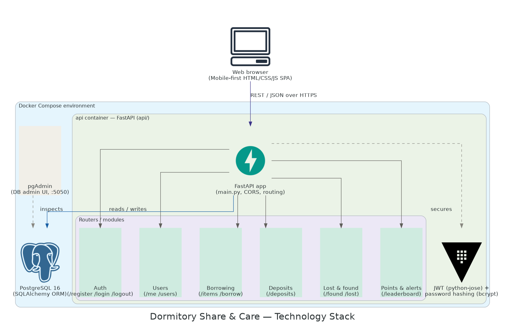
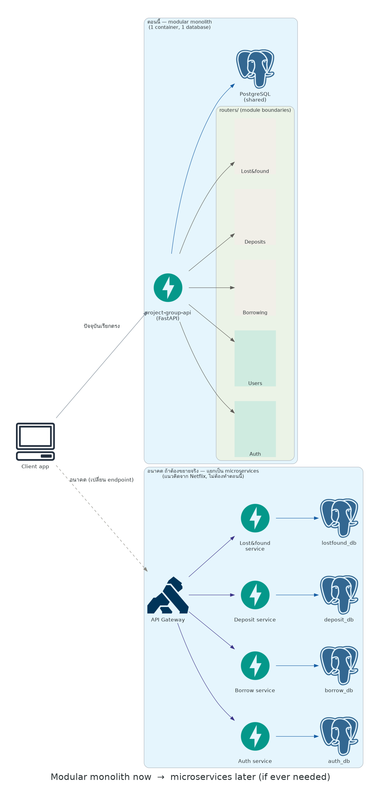

# 🏠 Dormitory Share & Care

ระบบเว็บแอปสำหรับหอพัก — **ยืม-คืนของส่วนกลาง, ฝากของ, ของหายได้คืน และแต้มความดี (Karma Points)** พร้อม **แผงควบคุมสำหรับนิติบุคคล**
ออกแบบแบบ Mobile-First (บนจอคอมเปลี่ยนเป็นเมนูด้านซ้ายอัตโนมัติ) ทุกฟีเจอร์ทำงานจริงกับฐานข้อมูล PostgreSQL ผ่าน REST API (FastAPI) และรวม Frontend + Backend ไว้ใน repo เดียว

 

---

## 📊 ความคืบหน้าของโปรเจกต์

**ฟีเจอร์หลักทั้งหมดทำงานจริงแล้ว** · ภาพรวมรวมงานเสริมใน Roadmap ≈ **76%** (16 จาก 21 งาน)

| ส่วน | สถานะ |
|---|---|
| UI ทุกหน้า (Mobile-First + Desktop sidebar, ไอคอน SVG ชุดเดียวกันทั้งระบบ) | ✅ เสร็จ |
| สมัครสมาชิก / เข้าสู่ระบบ / ออกจากระบบ (JWT) | ✅ เสร็จ |
| ยืม-คืนของส่วนกลาง + ถ่ายรูปสภาพของตอนคืน | ✅ เสร็จ |
| จำนวนของแต่ละชนิด (ว่างกี่ชิ้นจากทั้งหมด) | ✅ เสร็จ |
| คิวรอของว่าง (แจ้งเตือนเมื่อมีคนคืน) | ✅ เสร็จ |
| ฝากของ (รหัส QR, ยืนยันรับของ, ยกเลิก) | ✅ เสร็จ |
| สแกน QR ยืนยันส่งของ / รับคืน (กล้องมือถือ + พิมพ์รหัสแทนได้) | ✅ เสร็จ |
| ของหายได้คืน (แจ้งเจอ / ตามหา / ขอรับของ + ผู้พบยืนยัน) | ✅ เสร็จ |
| แต้มความดี + อันดับประจำเดือน | ✅ เสร็จ |
| เหรียญรางวัล (Badges) 8 เหรียญ พร้อมแถบความคืบหน้า | ✅ เสร็จ |
| แจ้งเตือน (รวมเตือนใกล้ครบกำหนดคืน) + ประวัติกิจกรรม | ✅ เสร็จ |
| อัปโหลดรูปภาพจริง (ย่อขนาดอัตโนมัติ) | ✅ เสร็จ |
| ค้นหาของส่วนกลาง + กรองหมวดหมู่ | ✅ เสร็จ |
| ช่องเลือกวัน-เวลาแบบปฏิทิน | ✅ เสร็จ |
| แผงควบคุมนิติบุคคล (Admin role) | ✅ เสร็จ |
| Docker Compose (db + pgAdmin + api) | ✅ เสร็จ |
| Database migration ด้วย Alembic | ❌ ยังไม่ทำ |
| Real-time ด้วย WebSocket (ตอนนี้เช็กทุก 30 วินาที) | ❌ ยังไม่ทำ |
| แจ้งเตือนผ่าน LINE / Push Notification | ❌ ยังไม่ทำ |
| เก็บรูปบน Cloud Storage (ตอนนี้เก็บในฐานข้อมูล) | ❌ ยังไม่ทำ |
| Deploy ขึ้นเซิร์ฟเวอร์จริง (HTTPS) | ❌ ยังไม่ทำ |

---

## ✨ ฟีเจอร์

### สำหรับผู้พักอาศัย

- 🔐 **บัญชีผู้ใช้** — สมัครด้วยหมายเลขห้องพัก ตั้งชื่อที่แสดงได้ รีเฟรชหน้าแล้วยังล็อกอินค้างอยู่
- ☂️ **ยืม-คืนของส่วนกลาง** — เห็นจำนวนที่ว่างจริงของแต่ละชนิด (เช่น **ว่าง 4 / 5 ชิ้น** พร้อมแถบสี), ค้นหา + กรองหมวดหมู่, เลือกระยะเวลา (1 ชม. / 1 วัน / 3 วัน), แจ้งคืนพร้อมรูปสภาพของและหมายเหตุ, ไฮไลต์รายการที่เลยกำหนด, กันการยืมชิ้นสุดท้ายซ้อนกัน (ล็อกแถวในฐานข้อมูล)
- ⏳ **คิวรอของว่าง** — ของที่ถูกยืมหมดกด "แจ้งเตือนเมื่อว่าง" เพื่อเข้าคิว เห็นว่าตัวเองอยู่คิวที่เท่าไหร่ เมื่อมีคนคืน / นิติเพิ่มจำนวน / ซ่อมเสร็จ ระบบแจ้งเตือนคนในคิวตามลำดับ
- 📦 **ฝากของ** — ฝากของให้ห้องอื่นพร้อมรูป เวลานัดรับ และรหัส QR, ผู้รับได้แจ้งเตือนทันที, ยืนยันรับของได้ทั้งผู้รับและผู้ฝาก, ยกเลิกได้, แยกรายการ "ฝากถึงฉัน / ที่ฉันฝาก / ประวัติ"
- 📷 **สแกน QR** — ผู้ฝากสแกน QR จากมือถือผู้รับเพื่อยืนยันว่าส่งถึงมือแล้ว (ได้แต้มทันที) ถ้ากล้องใช้ไม่ได้พิมพ์รหัสแทนได้
- 🔍 **ของหายได้คืน** — แจ้งเจอของ / ประกาศตามหาของ พร้อมรูป สถานที่ และเวลา, กด "นี่คือของฉัน" แล้วบอกลักษณะเฉพาะ → **ผู้ที่เก็บได้เป็นคนตรวจสอบและยืนยัน**, ระบบจับคู่ชื่อของอัตโนมัติแล้วแจ้งเตือนคนที่ตามหาอยู่, ปิดประกาศให้อัตโนมัติเมื่อได้ของคืน
- 🪙 **แต้มความดี** — คำนวณจริงจากสมุดบัญชีแต้มในฐานข้อมูล + อันดับ "คนดีศรีหอพัก" ประจำเดือน
- 🏅 **เหรียญรางวัล** — 8 เหรียญในหน้าโปรไฟล์ เหรียญที่ได้แล้วมีขอบทองพร้อมวันที่ได้รับ เหรียญที่ยังไม่ได้มีแถบความคืบหน้า และมีแจ้งเตือนเมื่อได้เหรียญใหม่
- 📅 **เลือกวัน-เวลาจากปฏิทิน** — ช่องเวลานัดรับของฝาก / เวลาที่เจอของ / เวลาที่ของหาย แตะแล้วมีปฏิทินขึ้นมาให้เลือก (กันเลือกเวลาที่เป็นไปไม่ได้ เช่น เจอของในอนาคต)
- 🔔 **แจ้งเตือน + ประวัติ** — แจ้งเตือนจริงเมื่อมีของฝาก / คำขอรับของ / ได้แต้ม / ได้เหรียญ / ของว่างแล้ว / ใกล้ครบกำหนดคืน / ประกาศจากนิติ และบันทึกทุกกิจกรรมไว้ในหน้าโปรไฟล์

### สำหรับนิติบุคคล (เมนู "นิติ" เห็นเฉพาะบัญชีนิติ)

| แท็บ | ทำอะไรได้ |
|---|---|
| ภาพรวม | ตัวเลขสรุป (ของว่าง, กำลังยืม, เลยกำหนด, กำลังซ่อม, ฝากของรอรับ, ของหาย, ผู้พัก), รายการที่เลยกำหนดหรือใกล้ครบกำหนดใน 2 ชม., ปุ่ม **ส่งประกาศถึงทุกห้อง**, ปุ่ม **สแกน QR** |
| คลังของ | เพิ่ม / แก้ชื่อ หมวด จำนวน ไอคอน, ตั้งสถานะ เปิดให้ยืม / ซ่อม / ปิดใช้งาน, ลบได้เฉพาะของที่ยังไม่เคยถูกยืม (ของที่มีประวัติให้ปิดใช้งานแทน) |
| การยืม | ดูของที่ถูกยืมอยู่ทั้งหมด (ห้องไหน คืนเมื่อไร), บันทึกรับคืนแทนผู้ยืม หรือสแกน QR การยืม (`BR-`) ตอนผู้ยืมเอาของมาคืนที่ออฟฟิศ |
| ฝากของ | ดูรายการฝากของทุกห้องพร้อมรหัส |
| ผู้พัก | ค้นหาห้อง, ดูแต้มและจำนวนของที่ยืมอยู่, ปิด / เปิดใช้งานบัญชี |

### กติกาแต้มความดี

| การกระทำ | แต้ม |
|---|---|
| คืนของส่วนกลางตรงเวลา (ยืมไว้อย่างน้อย 10 นาที กันการปั๊มแต้ม) | +10 |
| ของที่ฝากถูกส่งถึงมือผู้รับ (ผู้ฝากได้แต้ม) | +5 |
| เก็บของหายได้ และคืนถึงเจ้าของสำเร็จ | +20 |

### เหรียญรางวัล

| เหรียญ | เงื่อนไข |
|---|---|
| เริ่มต้นดี | ยืมของส่วนกลางครั้งแรก |
| ขาประจำ | ยืมของส่วนกลางครบ 10 ครั้ง |
| ตรงต่อเวลา | คืนของตรงเวลา 5 ครั้ง |
| เป๊ะทุกนัด | คืนของตรงเวลา 20 ครั้ง |
| พลเมืองดี | ส่งของฝากถึงมือผู้รับ 5 ครั้ง |
| ฮีโร่ของหาย | คืนของหายให้เจ้าของครั้งแรก |
| นักสืบประจำหอ | คืนของหายให้เจ้าของ 5 ครั้ง |
| คนดีศรีหอ | สะสมแต้มความดีครบ 100 แต้ม |

การคืนตรงเวลานับเฉพาะการยืมที่นานกว่า 10 นาที (กติกาเดียวกับการให้แต้ม)

## 🏗️ สถาปัตยกรรมระบบ (Architecture)

### Technology stack



Frontend เป็น mobile-first SPA (HTML/CSS/JS ล้วน) คุยกับ FastAPI ผ่าน REST/JSON โดยใช้ JWT ยืนยันตัวตน แล้วเก็บข้อมูลใน PostgreSQL — ทั้งหมดรันผ่าน Docker Compose โดย backend แบ่งเป็นโมดูลตามฟีเจอร์ใน `routers/` และมีสิทธิ์ 2 ระดับ: ผู้พักอาศัย และนิติบุคคล (`is_admin`)

### แนวทางขยายระบบในอนาคต



ตอนนี้ backend เป็น modular monolith (1 container แบ่งโมดูลผ่าน `routers/`) ถ้าในอนาคตต้องรองรับหลายหอพักหรือผู้ใช้จำนวนมาก สามารถแยกแต่ละโมดูลเป็น microservice พร้อม API Gateway และฐานข้อมูลแยกต่อ service ได้

### ฐานข้อมูล

| ตาราง | เก็บอะไร |
|---|---|
| `users` | บัญชีผู้ใช้ (username = หมายเลขห้อง, `is_admin` = นิติบุคคล) |
| `items` / `borrow_records` | ของส่วนกลาง (จำนวนทั้งหมด `quantity`, สถานะ ว่าง/ซ่อม/ปิดใช้งาน) และประวัติการยืม-คืน (รวมรูปตอนคืน) — จำนวนที่ว่างคำนวณสดจากรายการยืมที่ยังไม่คืน |
| `item_waitlist` | คิวรอของว่าง |
| `deposits` | รายการฝากของ + รหัสรับของ |
| `found_items` / `lost_reports` / `claims` | ของที่เก็บได้, ประกาศตามหา, คำขอรับของ |
| `point_transactions` | สมุดบัญชีแต้ม (แต้มรวม = ผลรวมของตารางนี้) |
| `user_badges` | เหรียญที่ผู้ใช้ได้รับแล้ว |
| `notifications` / `activities` | แจ้งเตือน และประวัติกิจกรรม |

ตารางและคอลัมน์ใหม่ถูกสร้าง / เติมให้อัตโนมัติตอน API เริ่มทำงาน ฐานข้อมูลเดิมไม่ต้องล้าง

## 🔌 API Endpoints

ดูและทดลองเรียกได้ทุกตัวที่ **http://localhost:8000/docs** (Swagger UI)

| กลุ่ม | Endpoints |
|---|---|
| Auth | `POST /register` `POST /login` `POST /logout` `POST /change-password` |
| Users | `GET /me` `GET /users` `GET/PUT/DELETE /users/{id}` `GET /check-username/{name}` |
| Borrowing | `GET /items` `POST /items/{id}/borrow` `GET /borrow/me` `POST /borrow/{id}/return` `POST/DELETE /items/{id}/waitlist` |
| Deposits | `GET /deposits/me` `POST /deposits` `POST /deposits/{id}/collect` `POST /deposits/{id}/cancel` |
| QR Scan | `POST /scan` (รหัส `DP-` = ยืนยันส่งของฝาก, `BR-` = นิติบันทึกรับคืน) |
| Lost & Found | `GET/POST /found` `POST /found/{id}/claims` `GET /claims/incoming` `POST /claims/{id}/approve` `POST /claims/{id}/reject` `GET/POST /lost` `POST /lost/{id}/resolve` |
| Points & Alerts | `GET /summary/me` `GET /points/me` `GET /leaderboard` `GET /badges/me` `GET /notifications` `POST /notifications/read-all` `GET /activity/me` |
| Admin (นิติ) | `GET /admin/overview` `GET/POST /admin/items` `PUT/DELETE /admin/items/{id}` `GET /admin/borrows` `POST /admin/borrows/{id}/return` `GET /admin/deposits` `GET /admin/users` `POST /admin/users/{id}/active` `POST /admin/announcements` |

## 🛠️ Tech Stack

**Frontend** — Vanilla HTML / CSS / JavaScript ไฟล์เดียว (ไม่มี framework, ไม่ต้อง build) · ฟอนต์ IBM Plex Sans Thai · ไอคอนและภาพประกอบเป็น SVG ในไฟล์ · สร้าง QR ด้วย [qrcode-generator](https://github.com/kazuhikoarase/qrcode-generator) · อ่าน QR จากกล้องด้วย [jsQR](https://github.com/cozmo/jsQR)

**Backend** — FastAPI · SQLAlchemy ORM · PostgreSQL 16 · JWT (python-jose) + bcrypt · Docker Compose

## 📁 โครงสร้างไฟล์

```
.
├── api/                          # Backend (FastAPI)
│   ├── Dockerfile
│   ├── requirements.txt
│   └── app/
│       ├── main.py               # entrypoint: รวม router, CORS, สร้างตาราง, ข้อมูลเริ่มต้น, บัญชีนิติ
│       ├── database.py
│       ├── models.py             # ตารางทั้งหมด
│       ├── schemas.py            # รูปแบบข้อมูลรับ-ส่ง (Pydantic)
│       ├── security.py           # JWT + hash รหัสผ่าน
│       ├── deps.py               # get_current_user / get_current_admin
│       ├── services.py           # แต้ม, แจ้งเตือน, กิจกรรม, จำนวนของว่าง, คิวรอ, เหรียญ (ใช้ร่วมกันทุกฟีเจอร์)
│       └── routers/
│           ├── auth.py
│           ├── users.py
│           ├── items.py          # ยืม-คืน + คิวรอของว่าง
│           ├── deposits.py       # ฝากของ
│           ├── scan.py           # สแกน QR / พิมพ์รหัส
│           ├── lostfound.py      # ของหายได้คืน + คำขอรับของ
│           ├── community.py      # แต้ม, อันดับ, เหรียญ, แจ้งเตือน, ประวัติ
│           └── admin.py          # แผงควบคุมนิติบุคคล
├── .env.example
├── .gitignore
├── docker-compose.yml
├── dormitory-share-care.html     # Frontend ทั้งหมด
├── tech-stack.png
├── microservices-evolution.png
└── README.md
```

## 🚀 วิธีใช้งาน

### 1. Clone repo

```bash
git clone https://github.com/Kedzies/Dormitory-Share-Care.git
cd Dormitory-Share-Care
```

### 2. ตั้งค่าและรัน Backend

```bash
cp .env.example .env
```

เปิด `.env` แล้วแก้:

- `SECRET_KEY` — ใส่ค่าสุ่ม (รัน `openssl rand -hex 32` แล้วนำผลลัพธ์ไปใส่)
- `ADMIN_USERNAME` / `ADMIN_PASSWORD` — บัญชีนิติบุคคล (รหัสผ่านอย่างน้อย 6 ตัวอักษร) ระบบสร้างให้อัตโนมัติตอน API เริ่มทำงาน ถ้ามีบัญชีชื่อนี้อยู่แล้วจะแค่เพิ่มสิทธิ์นิติให้ ไม่เปลี่ยนรหัสผ่านเดิม

จากนั้น:

```bash
docker compose up -d --build
```

- Swagger UI: **http://localhost:8000/docs**
- Health check: **http://localhost:8000/health**
- pgAdmin: **http://localhost:5050** → login ตามค่าใน `.env` → Register Server → Host `db`, Port `5432`, Username/Password ตาม `POSTGRES_USER` / `POSTGRES_PASSWORD`

ครั้งแรกที่รัน ระบบจะสร้างตาราง ของส่วนกลางเริ่มต้น 6 ชนิด และบัญชีนิติให้อัตโนมัติ

### 3. เปิด Frontend

```bash
python -m http.server 5500
```

(บน macOS / Linux ใช้ `python3`) แล้วเข้า **http://localhost:5500/dormitory-share-care.html** — ต้องเปิดผ่าน server ห้ามดับเบิลคลิกไฟล์ตรงๆ เพราะเบราว์เซอร์จะบล็อกการเชื่อมต่อ backend

### 4. ลองใช้งานแบบ 2 ห้อง + นิติ (แนะนำสำหรับเดโม)

เปิดเบราว์เซอร์ปกติ 1 หน้าต่าง + หน้าต่างไม่ระบุตัวตน (Incognito) อีก 1 หน้าต่าง แล้วสมัครคนละห้อง เช่น `B-304` กับ `B-201` และล็อกอินบัญชีนิติในอีกเบราว์เซอร์หนึ่ง

1. **นิติ** → แท็บ คลังของ → ตั้งจำนวนร่มเป็น 5 ชิ้น, เพิ่มของใหม่ 1 ชิ้นจำนวน 1
2. **B-304** ยืมของชิ้นใหม่ → **B-201** เห็นว่า "ถูกยืมหมด" → กด "แจ้งเตือนเมื่อว่าง" (คิวที่ 1)
3. **B-304** แจ้งคืนพร้อมถ่ายรูป → **B-201** ได้แจ้งเตือน "ว่างแล้ว!" → B-304 ได้เหรียญ "เริ่มต้นดี"
4. **B-304** ฝากกุญแจให้ `B-201` (เลือกเวลานัดรับจากปฏิทิน) → **B-201** เปิดรายการแล้วโชว์ QR → **B-304** กด "สแกน QR ส่งของ" → B-304 ได้ +5
5. **B-201** ประกาศตามหา "หูฟัง" → **B-304** แจ้งเจอ "หูฟังสีขาว" → B-201 ได้แจ้งเตือนว่าอาจเป็นของตัวเอง
6. **B-201** กด "นี่คือของฉัน" → **B-304** ตรวจรายละเอียดแล้วกดยืนยัน → B-304 ได้ +20, ขึ้นอันดับ และได้เหรียญ "ฮีโร่ของหาย"
7. **นิติ** → ส่งประกาศถึงทุกห้อง → ทั้งสองห้องเห็นแจ้งเตือน
8. เปิด pgAdmin ดูข้อมูลในตารางเปลี่ยนตามการใช้งานจริง

### 5. ปิดระบบ

```bash
docker compose down       # หยุด container เก็บข้อมูลไว้
docker compose down -v    # หยุด + ล้างข้อมูลทั้งหมด
```

## ⚠️ ข้อจำกัดที่ทราบ

- **กล้องสแกน QR ใช้ได้เฉพาะ `https://` หรือ `localhost`** — ถ้าเปิดจากมือถือผ่าน IP ในวง LAN (เช่น `http://192.168.x.x:5500`) ต้องพิมพ์รหัสแทน จะใช้กล้องบนมือถือได้เมื่อ deploy แบบ HTTPS
- รูปภาพเก็บในฐานข้อมูลแบบ base64 (ย่อเหลือด้านยาวสุด 900px ก่อนส่ง) — พอสำหรับต้นแบบ แต่ระบบจริงควรย้ายไป Cloud Storage
- การแจ้งเตือนอัปเดตทุก 30 วินาที ไม่ใช่ real-time
- คิวรอของว่างเป็นการ "แจ้งเตือนตามลำดับ" ไม่ได้กันของไว้ให้ — คนที่ได้แจ้งเตือนต้องรีบกดยืมเอง
- token ที่ logout แล้วเก็บไว้ในหน่วยความจำ — รีสตาร์ต backend แล้ว token เก่าที่ยังไม่หมดอายุจะใช้ได้อีกครั้ง (ระบบจริงควรใช้ Redis)
- ไลบรารี QR โหลดจาก CDN — ถ้าออฟไลน์จะแสดงเป็นรหัสตัวอักษรแทน และสแกนด้วยกล้องไม่ได้ (พิมพ์รหัสได้ตามปกติ)
- คอลัมน์ใหม่เติมให้ฐานข้อมูลเดิมด้วยโค้ดตอนเริ่มระบบ ยังไม่ใช่ migration เต็มรูปแบบ (Alembic)

## 🗺️ Roadmap

- [x] สมัคร / เข้าสู่ระบบ / ออกจากระบบ กับ Backend จริง
- [x] ยืม-คืนของ กับ Backend จริง
- [x] ฝากของ กับ Backend จริง
- [x] ของหายได้คืน กับ Backend จริง
- [x] ระบบแต้มความดี + อันดับ
- [x] แจ้งเตือน + ประวัติกิจกรรม
- [x] อัปโหลดรูปภาพจริง
- [x] ออกแบบ UI ใหม่ (ไอคอน SVG, ภาพประกอบ, รองรับจอคอม)
- [x] จำนวนของแต่ละชนิด + คิวรอของว่าง
- [x] Dashboard สำหรับนิติบุคคล (Admin)
- [x] ช่องเลือกวัน-เวลาแบบปฏิทิน
- [x] สแกน QR ยืนยันส่งของ / รับคืน
- [x] เหรียญรางวัล (Badges)
- [ ] Alembic สำหรับ database migration
- [ ] Real-time ด้วย WebSocket
- [ ] แจ้งเตือนผ่าน LINE / Push Notification
- [ ] เก็บรูปบน Cloud Storage
- [ ] Deploy ขึ้นเซิร์ฟเวอร์จริง (HTTPS)

## 📄 License

โปรเจกต์นี้จัดทำเพื่อการศึกษา สามารถนำไปต่อยอดพัฒนาได้ตามความเหมาะสม
67160348 บุณยนุช มโนมัยสกุล (AAI)
67160352 ปัณณกร พลเสน (AAI)
